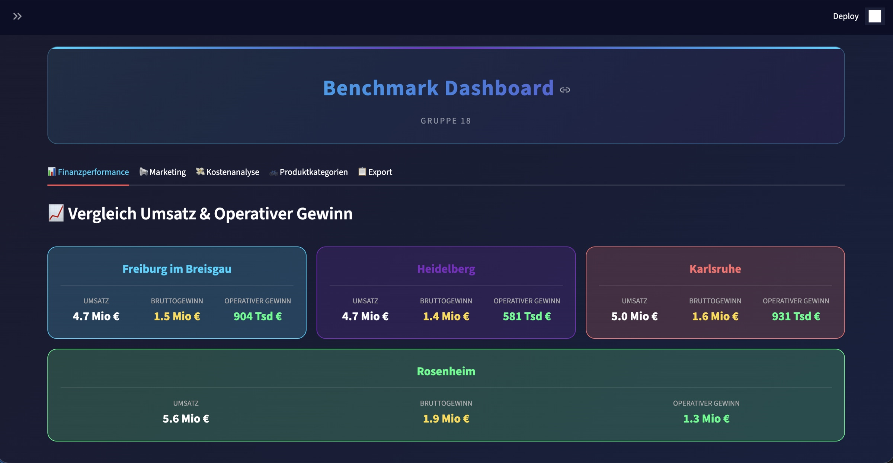

# Benchmark Dashboard — Gruppe 18

Multi-store retail performance comparison built as a Streamlit dashboard for the **Software Engineering Project (Sopra)** course at HdM Stuttgart.



## What it does

Compares monthly sales, gross profit and product-category mix across multiple bike-retail stores (Rosenheim · Freiburg · Karlsruhe). All numbers feed in live from a SQL Server data warehouse via dedicated benchmark views.

- Monthly KPI comparison (revenue, gross profit, units sold)
- Product-category breakdown — E-Bike · MTB · City/Trekking · Kids · Other
- Trend charts powered by Plotly
- Raw-data export to CSV
- Dark-themed UI

## Tech stack

- **Frontend:** Streamlit, Plotly
- **Data:** SQL Server (custom analytical views), pandas, PyODBC
- **Architecture:** Modular Python — config, store registry, styles and utils separated under `src/`

## Project structure

```
.
├── app_dashboard.py             Main Streamlit app
├── src/
│   ├── config.py                Constants (month names, etc.)
│   ├── db_connect.py            SQL Server connection from config.json
│   ├── stores_config.py         Store registry — add a new store = one entry
│   ├── styles.py                Dashboard CSS
│   └── utils.py                 Currency formatters
├── sql/
│   ├── install-erpdb.sql        ERP demo-DB schema bootstrap
│   └── GRUPPE_18_BENCHMARK_VIEWS_V2.sql   Benchmark view definitions
├── docs/
│   ├── benchmark-views.md       Detailed docs on the SQL view layers
│   └── screenshot.jpg
├── config.example.json
└── requirements.txt
```

## Getting started

```bash
git clone https://github.com/dreeeez/Sopra_Benchmark_18.git
cd Sopra_Benchmark_18
pip install -r requirements.txt

cp config.example.json config.json   # fill in your SQL Server credentials

streamlit run app_dashboard.py
```

Then open <http://localhost:8501>.

**Prerequisites:** Python 3.10+, ODBC Driver 18 for SQL Server, access to the Sopra ERP database (or your own data behind the same view schema).

## Architecture (SQL views)

The dashboard reads from a 5-layer view hierarchy: **Standardisation → Aggregation → KPI → Comparison → Export**. See [`docs/benchmark-views.md`](docs/benchmark-views.md) for the full breakdown of each layer and column.

## Course context

Built as a team project (Gruppe 18) for the **Sopra — Software Engineering Project** module at **Hochschule der Medien (HdM) Stuttgart**, 2025.
